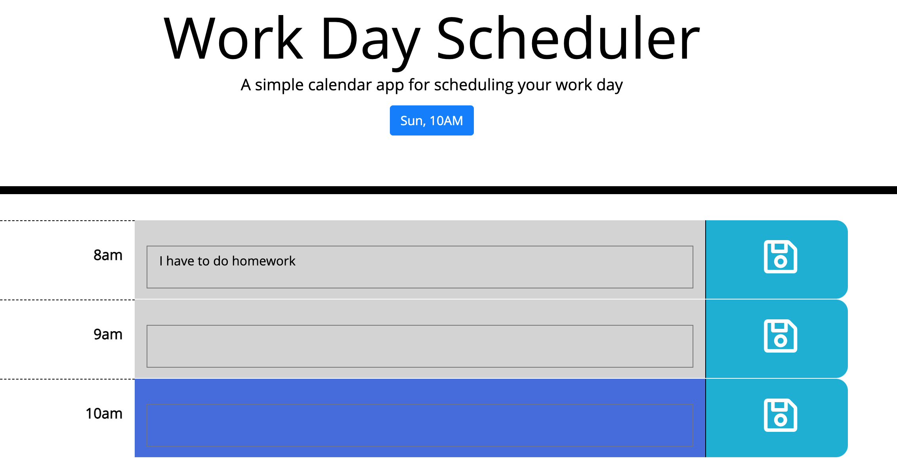

# Work Day Scheduler 

## Description 

A day calandar showing savable events that change color based on if they are a past, present, or future event.

## Installation
View the site at 
https://adamwest023.github.io/Work-Day-Scheduler/

## Usage 
Click on the textarea of each time slot to add or edit an event. once finished click the save icon to save it to the local storage.

## Credits
Andres Long - Tutor
Joseph Sisk - UT bootcamp TA

